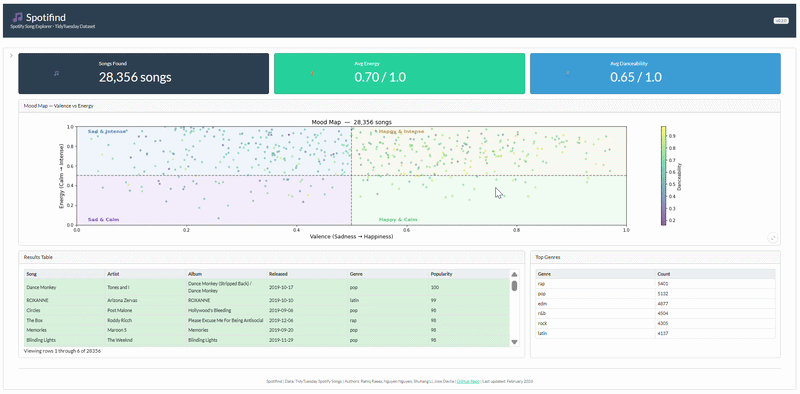

# Spotifind

## **Users**

Spotifind is a dashboard that lets users search for music using Spotify's audio features instead of just genres. Users can filter songs by features like energy level, danceability, tempo, and mood (called "valence" in the data). Especially useful for people who are interested in the technical side of music, such as DJs or sound technicians.

The main dashboard can be accessed [here](https://019cd979-0869-b30b-4ea7-3d34f429975f.share.connect.posit.cloud/)

## **Contributors**

Rahiq Raees, Nguyen Nguyen, Shuhang Li, Jose Davila

If you are interested in contributing to this dashboard, please review the [CONTRIBUTING.md](CONTRIBUTING.md) document for contributing guide and instruction how to set up the app locally.

## Dataset Acknowledgement

This project was developed using the following dataset:
- Dataset name: [Spotify Songs](https://github.com/rfordatascience/tidytuesday/blob/main/data/2020/2020-01-21/readme.md)
- License: MIT

## Code of Conduct

Please note that this project is released with a [Code of Conduct](CODE_OF_CONDUCT.md). By participating in this project you agree to abide by its terms.

## License

This project is licensed under the MIT License, please see [LICENSE](LICENSE) file for details.

## Citation

If you wish to use this app anywhere, please cite as the following:
Raess, R., Nguyen, N., & Li, S., Davila, J. (2026) Spotifind.

