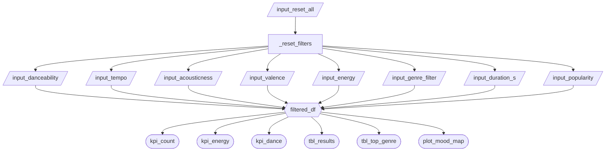

# App Specification

## 2.1 Updated Job Stories

| #   | Job Story                       | Status         | Notes                         |
| --- | ------------------------------- | -------------- | ----------------------------- |
| 1   | When Alex prepares a playlist for his gym morning class on Saturdays, he needs to select the first 15 songs with energy > 0.85 and tempo 135-155 BPM, which allows him to complete the selection within 20 minutes. | ✅ Implemented | Energy and tempo sliders filter songs; results table shows matching songs |
| 2   | When Alex creates a 'Late Night Focused Study' playlist for clients, he needs to filter 10 songs with a valence < 0.3, acoustics > 0.7, and duration < 240 seconds, so that clients receive the perfect study tracks. | ✅ Implemented | Valence, acousticness, and duration sliders all implemented |
| 3   | When Alex wants to discover new songs for the dance floor, he needs to look at scatter plots of songs with danceability > 0.8 but popularity < 0.2, so that he can find hidden potential songs that are not yet popular but are suitable for parties, thus improving his reputation. | 🔄 Revised | Danceability and popularity sliders implemented; mood map replaces scatter plot as the primary visual discovery tool |

---

## 2.2 Component Inventory

| ID                   | Type          | Shiny widget / renderer | Depends on                                                              | Job story  |
| -------------------- | ------------- | ----------------------- | ----------------------------------------------------------------------- | ---------- |
| `input_danceability` | Input         | `ui.input_slider()`     | —                                                                       | #3         |
| `input_tempo`        | Input         | `ui.input_slider()`     | —                                                                       | #1         |
| `input_acousticness` | Input         | `ui.input_slider()`     | —                                                                       | #2         |
| `input_valence`      | Input         | `ui.input_slider()`     | —                                                                       | #2         |
| `input_energy`       | Input         | `ui.input_slider()`     | —                                                                       | #1         |
| `input_duration_s`   | Input         | `ui.input_slider()`     | —                                                                       | #2         |
| `input_popularity`   | Input         | `ui.input_slider()`     | —                                                                       | #3         |
| `input_genre_filter` | Input         | `ui.input_select()`     | —                                                                       | #1, #2, #3 |
| `filtered_df`        | Reactive calc | `@reactive.calc`        | `input_danceability`, `input_tempo`, `input_acousticness`, `input_valence`, `input_energy`, `input_duration_s`, `input_popularity`, `input_genre_filter` | #1, #2, #3 |
| `kpi_count`          | Output        | `@render.text`          | `filtered_df`                                                           | #1, #2, #3 |
| `kpi_energy`         | Output        | `@render.text`          | `filtered_df`                                                           | #1         |
| `kpi_dance`          | Output        | `@render.text`          | `filtered_df`                                                           | #3         |
| `plot_mood_map`      | Output        | `@render.plot`          | `filtered_df`                                                           | #2, #3     |
| `tbl_results`        | Output        | `@render.data_frame`    | `filtered_df`                                                           | #1, #2     |
| `tbl_top_genre`      | Output        | `@render.data_frame`    | `filtered_df`                                                           | #1, #2, #3 |

---

## 2.3 Reactivity Diagram

---

## 2.4 Calculation Details

### `filtered_df`

- **Depends on:** `input_danceability`, `input_tempo`, `input_acousticness`, `input_valence`, `input_energy`, `input_duration_s`, `input_popularity`, `input_genre_filter`
- **Transformation:** Filters the dataset to rows where danceability, tempo, acousticness, valence, energy, duration, and popularity fall within the selected slider ranges. If a specific genre is selected, further filters to only rows matching that genre.
- **Consumed by:** `kpi_count`, `kpi_energy`, `kpi_dance`, `plot_mood_map`, `tbl_results`, `tbl_top_genre`

---

## Complexity Enhancement

**Feature: Reset Button**

A "Reset Filters" button was added to the bottom of the sidebar using `@reactive.effect` + `@reactive.event(input.reset_all)`. When clicked, it restores all 7 sliders and the genre dropdown to their default values using `ui.update_slider()` and `ui.update_select()`.

**Why it improves UX:** After applying multiple narrow filters, users have no easy way to return to the full dataset view. The reset button solves this in one click, without requiring the user to manually drag each slider back. This directly supports all three job stories since Alex can quickly switch between building different playlist types without residual filters from a previous search interfering.
